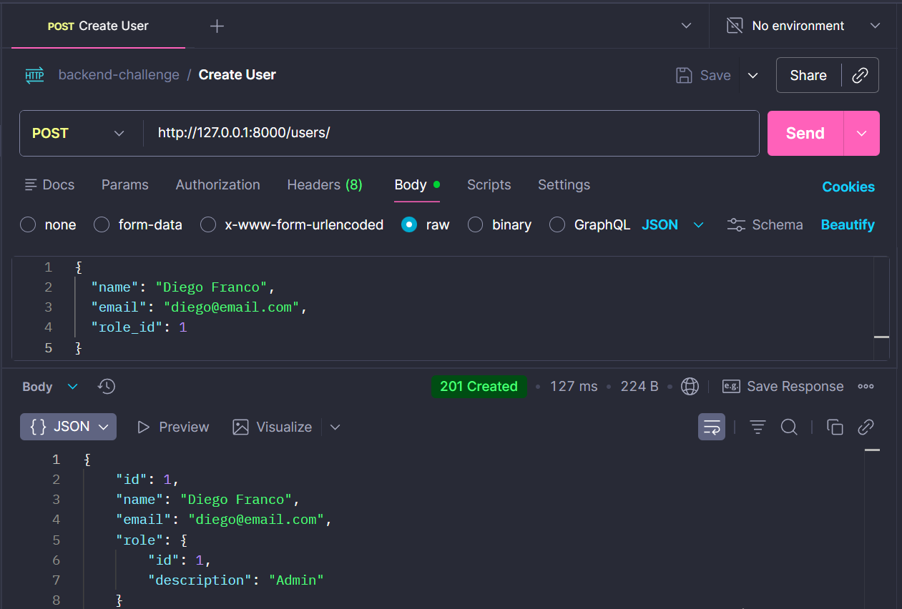

#  API de Controle de Acesso

API REST desenvolvida em Python com **FastAPI** para gerenciamento de usuários e controle de acesso baseado em Roles.

O projeto foi construído seguindo princípios de **Clean Code**, **Arquitetura em Camadas** e **Testes Automatizados**, preparado para escalar de um ambiente local simples para uma arquitetura produtiva containerizada.

## 🛠 Tecnologias Utilizadas

* **Linguagem:** Python 3.11+
* **Framework:** FastAPI
* **Servidor (Dev):** Uvicorn
* **Servidor (Prod):** Gunicorn gerenciando Uvicorn workers
* **Banco de Dados:** SQLite (Ambiente Local) / Suporte a PostgreSQL (Produção)
* **ORM:** SQLAlchemy
* **Testes:** Pytest & TestClient
* **Infraestrutura:** Docker & Docker Compose

---

## Como Executar Localmente 

Recomendado para desenvolvimento rápido e depuração.

### 1. Pré-requisitos
* Git
* Python 3.10 
* Pip

### 2. Instalação

Clone o repositório e entre na pasta:
```bash
git clone [https://github.com/dgusfr/backend-challenge.git](https://github.com/dgusfr/backend-challenge.git)
cd backend-challenge

```

Crie e ative o ambiente virtual:

```bash
# Linux/macOS
python3 -m venv venv
source venv/bin/activate

# Windows 
python -m venv venv
.\venv\Scripts\activate

```

Instale as dependências:

```bash
pip install -r requirements.txt

```

### 3. Configuração do Banco de Dados (SQLite)

O projeto utiliza SQLite localmente. Siga a ordem abaixo para inicializar a estrutura:

1. **Inicialize a API uma vez** (Isso criará o arquivo `test.db` vazio):
```bash
uvicorn main:app --reload

```


*Aguarde aparecer "Application startup complete" e pressione `Ctrl+C` para parar.*

2. **Popule o banco com dados iniciais** (Roles: Admin e Dev):
```bash
python init_db_sql.py

```


*Você verá a mensagem: "Sucesso! Roles inseridas via SQL."*

### 4. Rodar a Aplicação

Inicie o servidor em modo de desenvolvimento (com auto-reload):

```bash
uvicorn main:app --reload --host 0.0.0.0 --port 8000

```

Acesse: `http://localhost:8000`

---

## Como Executar Localmente (Com Docker)

Se preferir rodar a aplicação isolada em container.

### 1. Build da Imagem

```bash
docker build -t backend-challenge-api .

```

### 2. Rodar o Container

```bash
docker run -p 8000:8000 backend-challenge-api

```

*Nota: Ao rodar via Docker, o banco de dados interno do container será recriado a cada reinício, pois o docker não é persiste nos dados*

---

## ✅ Executando Testes

O projeto possui testes automatizados de infraestrutura e regras de negócio utilizando `pytest` com banco de dados em memória (isolado).

```bash
pytest 

```


## Consumindo a API (Postman/Insomnia)

é posisvel importar o arquivo **`docs/openapi.yaml`** no Postman ou Insomnia para facilitar os testes das rotas.




---

## 📖 Documentação da API

Você pode visualizar a especificação da API de duas formas:

1. **Swagger UI (Online):**
Com a API rodando, acesse: `http://localhost:8000/docs`


2. **Documentação Offline (Para Postman/Insomnia):**
O arquivo de especificação OpenAPI (Swagger) está disponível no repositório em:
📂 **`docs/openapi.yaml`**

* **Como usar:** Importe este arquivo diretamente no Postman ou no [Swagger Editor](https://editor.swagger.io/) para visualizar os contratos, schemas e testar as rotas sem precisar rodar o código Python.


---

## ☁️ Guia de Deploy em Produção

Para um ambiente produtivo robusto, recomenda-se abandonar o servidor de desenvolvimento e utilizar uma arquitetura com **Gunicorn**, **Nginx** e **PostgreSQL**.

### Estratégia de Arquitetura

1. **Gunicorn:** Gerenciador de processos (Process Manager) que controla múltiplos workers do Uvicorn para aproveitar o paralelismo da CPU.
2. **Nginx:** Proxy Reverso para lidar com SSL/TLS, cabeçalhos de segurança e compressão Gzip.
3. **PostgreSQL:** Banco de dados relacional robusto (substituindo o SQLite).

### 1. Exemplo de Dockerfile de Produção

O `Dockerfile` na raiz já está preparado, mas para produção recomenda-se o comando de entrada otimizado:

```dockerfile
# ... (steps de build) ...
# Comando de Produção: Gunicorn + Uvicorn Workers
CMD ["gunicorn", "-w", "4", "-k", "uvicorn.workers.UvicornWorker", "-b", "0.0.0.0:8000", "main:app"]

```

*Ajuste `-w 4` (workers) conforme o número de núcleos da CPU (Fórmula sugerida: 2 x Núcleos + 1).*

### 2. Exemplo de Docker Compose (Produção)

Crie um arquivo `docker-compose.prod.yml` no servidor:

```yaml
services:
  api:
    build: .
    container_name: api_prod
    restart: always
    environment:
      - DATABASE_URL=postgresql+psycopg2://user:pass@db:5432/dbname
    expose:
      - "8000"
    command: gunicorn -w 4 -k uvicorn.workers.UvicornWorker -b 0.0.0.0:8000 main:app
    depends_on:
      - db

  nginx:
    image: nginx:alpine
    container_name: nginx_proxy
    ports:
      - "80:80"
      - "443:443"
    volumes:
      - ./nginx.conf:/etc/nginx/conf.d/default.conf:ro
    depends_on:
      - api

  db:
    image: postgres:15
    environment:
      POSTGRES_USER: user
      POSTGRES_PASSWORD: pass
      POSTGRES_DB: dbname
    volumes:
      - pgdata:/var/lib/postgresql/data

volumes:
  pgdata:

```

### 3. Configuração do Nginx (`nginx.conf`)

```nginx
server {
    listen 80;
    server_name seu-dominio.com;

    location / {
        proxy_pass http://api:8000;
        proxy_set_header Host $host;
        proxy_set_header X-Real-IP $remote_addr;
        proxy_set_header X-Forwarded-For $proxy_add_x_forwarded_for;
        proxy_set_header X-Forwarded-Proto $scheme;
    }
}

```

### 4. Executando o Deploy

No servidor de produção:

```bash
docker compose -f docker-compose.prod.yml up -d --build

```

```

```